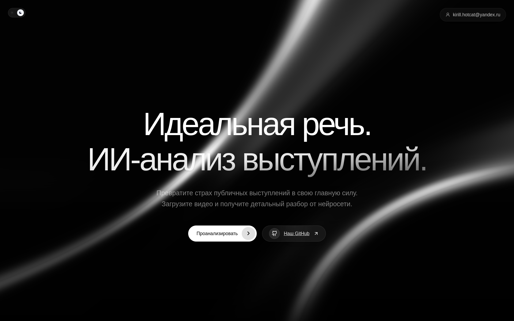
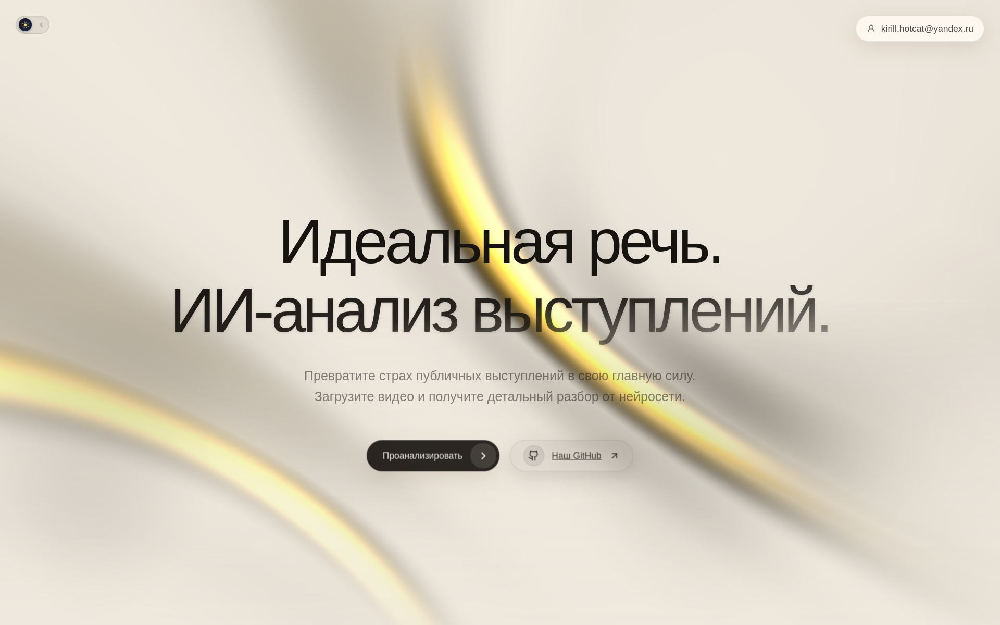
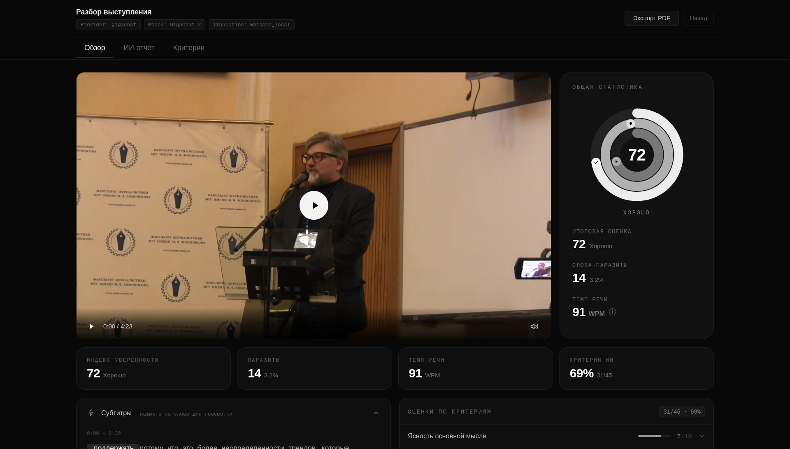
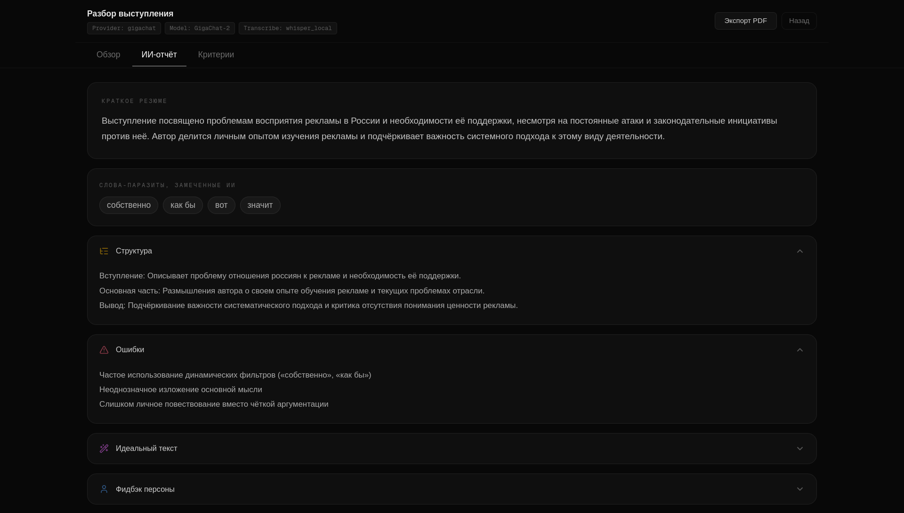
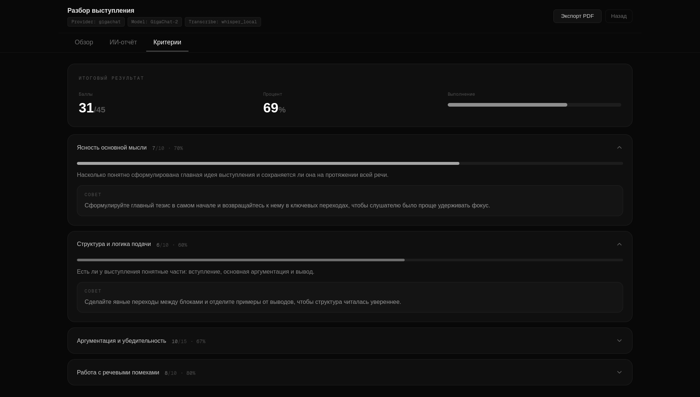
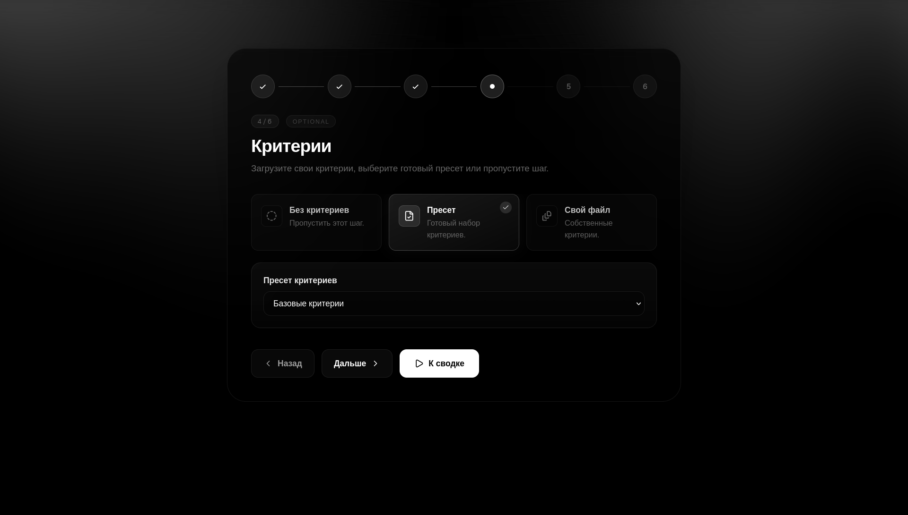

# Charisma Master

Улучшай свою речь с **[нашей помощью](https://charisma-master.ru)**!

**[Charisma Master](https://charisma-master.ru)** - это сервис для AI-анализа выступлений. Платформа позволяет тренировать свои ораторские навыки на основе обратной связи, которую предоставляет искусственный интеллект. Полностью бесплатное решение с поддержкой русского языка.

<p align="center">
  
  
</p>

**Сервис анализирует выступающего**: ищет специфичные слова-паразиты, следит за жестикуляцией спикера, скоростью, громкостью и тональностью его речи, а также взглядом выступающего, чтобы на основе взвешенных метрик выставить ему общую оценку за выступление.

Благодаря **транскрибации речи и субтитрам с привязкой по времени**, пользователь с легкостью может перемотать видео выступления на нужный ему момент. Все слова-паразиты и длительные паузы в плеере с субтитрами подсвечены красным.





**Киллер-фичей** сервиса является его ориентированность на потребности студентов. Платформа может анализировать все основные виды артефактов, которые возникают у студентов при подготовке к выступлению:

1. Текст речи
1. Файл презентации
1. Видеозапись выступления

**ИИ** дает персонализированные рекомендации, предлагает советы по улучшению речи и презентации, иногда подкрепляет советы ссылками из нашей базы знаний на бесплатные ресурсы для тренировки. **Агентная система** сама найдет дополнительную информацию (например, о конкурентах вашего проекта) в интернете.



Студент, который готовится к защите проекта или диплома, может загрузить документ, содержащий **критерии оценивания**. Нейросеть сама вычленит из текста основную информацию по критериям, выберет те, которые она способна оценить и предоставит пользователю итоговую оценку согласно регламенту его вуза.



## Архитектура

[](https://github.com/desmitry/charisma-master/actions/workflows/build.yaml)
[](https://github.com/desmitry/charisma-master/actions/workflows/deploy.yaml)

Микросервисная архитектура, для управления проектом используется uv workspaces. Проект представляет собой монорепозиторий. Состоит из Python и Rust микросервисов, общих пакетов (Python и Rust), а также фронтенда на NodeJS. Взаимодействие между сервисами происходит через NATS.

### Сервисы

| Сервис | Описание | Стек |
|--------|----------|------|
| `services/api_gateway` | FastAPI-бэкенд. Приём файлов, запуск задач, опрос статуса, выдача результатов и стриминг видео | FastAPI, Celery, uvicorn |
| `services/ml_worker` | Celery-воркер. Транскрибация, анализ видео/аудио, оценка выступления через LLM | Celery, Whisper, MediaPipe, GigaChat, OpenAI, LangGraph |
| `services/migrator` | Сервис миграции БД. Выполняет SQL-миграции через sqlx и загружает промпты/пресеты из `docs/` в Postgres | Rust, sqlx |
| `services/account` | Сервис управления аккаунтами. Обрабатывает NATS-сообщения: создание юзера, верификация, управление ролями | Rust, sqlx, NATS |
| `services/nginx` | Reverse-proxy. TLS-терминация (Let's Encrypt), rate limiting (10 r/s), прокси на фронтенд | NGINX, certbot |
| `services/frontend` | Веб-приложение. Интерфейс загрузки, индикатор прогресса, дашборд результатов | Next.js, React, Tailwind CSS |

### Общие пакеты

| Пакет | Описание |
|-------|----------|
| `packages/charisma_schemas` | Pydantic-модели, общие для api_gateway и ml_worker |
| `packages/charisma_storage` | Клиент SeaweedFS (S3-совместимый), используется обоими Python-сервисами |
| `packages/rust_common` | Общие Rust-утилиты (протобаф, логгер, NATS-хендлеры), используются account и migrator |
| `packages/proto` | Protobuf-схемы для NATS-сообщений (account, общие, логгер) |

### Протобаф схемы

| Путь | Описание |
|------|----------|
| `packages/proto/common.proto` | Общие сообщения (ошибки, статусы) |
| `packages/proto/logger.proto` | Схема для логирования через NATS |
| `packages/proto/account/users.proto` | Операции с пользователями (создание, обновление, роли) |
| `packages/proto/account/credentials.proto` | Операции с учетными данными (верификация, смена пароля) |
| `packages/proto/account/permissions.proto` | Получение ролей и прав доступа |

### Инфраструктура

| Компонент | Назначение |
|-----------|------------|
| Postgres | Хранит промпты (таблица `prompts`), пресеты критериев оценивания (таблица `presets`), веса для Data Driven алгоритмов (таблица `algorithm_weights`), а также данные аккаунтов (схема `account`) |
| SeaweedFS | Объектное хранилище для загруженных видео, презентаций, файлов критериев и результатов анализа |
| Redis | Брокер сообщений Celery, бэкенд результатов, blacklist JWT-токенов, счётчик дневного лимита обработок |
| NATS | Шина сообщений для микросервисов (используется микросервисами `account` и `api_gateway` для взаимодействия и обработки запросов) |

### Поток данных

1. Пользователь регистрируется и логинится - API Gateway отправляет NATS-запрос в `account`, получает JWT-токены.
1. Фронтенд авторизует запросы через Bearer-токен. Если токен истёк - автоматически обновляется через `/api/v1/auth/refresh`.
1. Пользователь загружает видео (или указывает ссылку на RuTube) через фронтенд. API Gateway проверяет дневной лимит обработок (Redis), затем - JWT пользователя.
1. API Gateway конвертирует видео в faststart MP4 и загружает в SeaweedFS (bucket `uploads`).
1. API Gateway отправляет Celery-задачу, содержащую ключи SeaweedFS objects.
1. ML Worker скачивает файлы из SeaweedFS, обрабатывает их и записывает результат обратно в SeaweedFS (bucket `results`). После успешного сохранения - инкрементит счётчик обработок в Redis.
1. Фронтенд опрашивает эндпоинт статуса задачи, затем получает итоговый анализ через API Gateway.
1. Воспроизведение видео идёт через API Gateway как StreamingResponse с поддержкой HTTP Range.

## Структура проекта

```
charisma-master/
├── .github/                     # GitHub Actions, шаблоны
├── .pre-commit-config.yaml      # Pre-commit хуки
├── k8s/                         # Kubernetes-конфигурация (base + overlays)
├── scripts/                     # Вспомогательные скрипты
├── tests/                       # Тесты
├── media/                       # Изображения для README
├── docker-compose.yaml          # Основная конфигурация Docker Compose
├── docker-compose.gpu.yaml      # Оверлей для использования GPU
├── docker-compose.override.yaml # Локальный оверлей Docker Compose
├── .dockerignore                # Исключения для сборки
├── pyproject.toml               # Корневой uv‑workspace
├── uv.lock                      # Lock для uv-пакетов
├── packages/                    # Общие пакеты
│   ├── charisma_schemas/        # Pydantic‑модели
│   ├── charisma_storage/        # Клиент SeaweedFS (S3‑совместимый)
│   ├── proto/                   # Protobuf схемы (NATS сообщения)
│   └── rust_common/             # Общие Rust‑утилиты
├── services/                    # Микросервисы проекта
│   ├── api_gateway/             # FastAPI‑бэкенд
│   ├── ml_worker/               # Celery‑воркер, LLM‑анализ
│   ├── migrator/                # Сервис миграции БД (sqlx + seed)
│   ├── account/                 # Сервис управления аккаунтами (NATS + sqlx)
│   ├── nginx/                   # Конфигурация Nginx + Certbot
│   └── frontend/                # Next.js фронтенд
├── docs/                        # Промпты и пресеты
│   ├── prompts/                 # Промпты для LLM
│   │   └── personas/            # Промпты для ролей
│   └── presets/                 # Пресеты оценивания
└── example.docker.env           # Пример Docker Compose env-файла
```

## Требования

### Основное:

- Docker, Docker Compose
- uv (для локальной разработки)
- Python 3.12
- Node.js 25 (для разработки фронтенда)
- Cargo 1.94.x
- Cargo Clippy + Cargo Formatter

### Pre-commit хуки

Проект использует pre-commit для автоматической проверки кода перед коммитом. Установите после клонирования:

```bash
uv sync --group dev
uv run pre-commit install
```

Хуки запускают `ruff check --fix` и `ruff format` для всех изменённых Python-файлов, а также `cargo fmt` и `cargo clippy` для Rust-сервисов (`account`, `migrator`), `mdformat` для Markdown-файлов. Также происходит проверка на утечку секретов в git-историю.

Для работы `mdformat` установите пакет через uv:

```bash
uv tool install mdformat
uv tool install --with mdformat-gfm --with mdformat-frontmatter mdformat
```

## Деплой

Перед первым запуском убедитесь, что:

1. DNS-записи `charisma-master.ru` и `www.charisma-master.ru` указывают на публичный IP сервера (`dig +short charisma-master.ru`).
1. На сервере открыты порты `80` и `443`.
1. Однократно выпущен TLS-сертификат Let's Encrypt:

```bash
docker compose --profile init up certbot-init
```

Сервис `certbot-init` поднимет временный HTTP-сервер на порту `80`, пройдёт ACME-челлендж и сохранит сертификат в named volume `certbot_certs`. После завершения контейнер остановится. Шаг выполняется один раз; повторный запуск не нужен - продление сертификатов делает фоновый сервис `certbot` (проверка раз в 12 часов, после успешного обновления - `nginx -s reload`).

Затем поднимаем продакшен:

```bash
docker compose up -d
```

Запускает все сервисы: Postgres, NATS, SeaweedFS (master, volume, filer, s3), migrator, Redis, account, ml_worker, api_gateway, nginx, certbot и frontend.

Nginx терминирует TLS, проксирует трафик на frontend (`frontend:3000`), ограничивает rate (10 r/s на IP, burst 20, 429 при превышении) и размер тела запроса (700 МБ).

Сервис migrator выполняет SQL-миграции (создание схемы `account`, таблиц, ролей и прав) и загружает промпты и пресеты из `docs/` в БД. Завершается со статусом `service_completed_successfully`.

Сервис account обрабатывает NATS-сообщения от api_gateway: регистрация, верификация, управление ролями и правами доступа. api_gateway стартует только после account-health.

Для включения GPU-поддержки ML Worker:

```bash
docker compose -f docker-compose.yaml -f docker-compose.gpu.yaml up -d
```

## Локальная разработка

### Бэкенд

```bash
uv sync

# Запуск инфраструктуры
docker compose up -d postgres nats seaweedfs-master seaweedfs-volume seaweedfs-filer seaweedfs-s3 redis

# Запуск мигратора
docker compose up migrator

# Запуск сервиса аккаунтов
docker compose up -d account account-health

# Запуск Celery-воркера
celery -A services/ml_worker/app.celery_app worker --loglevel=info --pool=solo

# Запуск API Gateway
uvicorn services.api_gateway.app.main:app --reload --host 0.0.0.0 --port 8000
```

### Фронтенд

```bash
cd services/frontend
npm install
npm run dev
```

## Конфигурация

Проект использует переменные окружения для настройки сервисов.

Docker Compose читает переменные из файла `.env` в корне проекта (создаётся из `example.docker.env`). Каждый Python-сервис также имеет свои `.docker.env` или `.env` файлы для специфичных настроек.

### Локальная разработка (не рекомендуется)

Для локальной разработки используйте файлы `.env` в директориях сервисов:

```bash
cp services/api_gateway/example.env services/api_gateway/.env
cp services/ml_worker/example.env services/ml_worker/.env
```

### Быстрый старт с Docker Compose

Скопируйте примеры конфигурации перед первым запуском:

```bash
# Для Docker Compose
cp example.docker.env .env

# Для сервисов
cp services/api_gateway/example.docker.env services/api_gateway/.docker.env
cp services/ml_worker/example.docker.env services/ml_worker/.docker.env
```

### Переменные окружения Docker Compose

Файл `example.docker.env` в корне проекта содержит переменные, используемые непосредственно в `docker-compose.yaml`:

| Переменная | По умолчанию | Описание |
|------------|--------------|----------|
| `POSTGRES_USER` | `charisma` | Пользователь PostgreSQL |
| `POSTGRES_PASSWORD` | `charisma` | Пароль PostgreSQL |
| `POSTGRES_DB` | `charisma` | Название базы данных |
| `MIGRATOR_IMAGE` | `ghcr.io/desmitry/charisma-master-migrator:latest` | Образ сервиса миграции БД |
| `ACCOUNT_IMAGE` | `ghcr.io/desmitry/charisma-master-account:latest` | Образ сервиса аккаунтов |
| `CERTBOT_IMAGE` | `ghcr.io/desmitry/charisma-master-certbot:latest` | Образ сервиса Certbot для Nginx |
| `ML_WORKER_IMAGE` | `ghcr.io/desmitry/charisma-master-ml-worker:latest` | Образ ML Worker |
| `API_GATEWAY_IMAGE` | `ghcr.io/desmitry/charisma-master-api-gateway:latest` | Образ API Gateway |
| `FRONTEND_IMAGE` | `ghcr.io/desmitry/charisma-master-frontend:latest` | Образ Frontend |
| `CELERY_LOG_LEVEL` | `info` | Уровень логирования Celery (`debug`, `info`, `warning`, `error`, `critical`) |

Подробные таблицы переменных для каждого сервиса вынесены в их собственные README:

- **API Gateway** - [`services/api_gateway/README.md`](services/api_gateway/README.md)
- **Account** - [`services/account/README.md`](services/account/README.md)
- **ML Worker** - [`services/ml_worker/README.md`](services/ml_worker/README.md)

## Скрипты

В проекте есть несколько вспомогательных скриптов:

- **`scripts/compile_proto.py`** - компилирует Protobuf-схемы из `packages/proto/` в Rust-код для сервисов `account` и `migrator`. Запускается автоматически при сборке Docker-образов, но может понадобиться при локальной разработке.

- **`scripts/load_weight_json.py`** - загружает конфигурацию весов алгоритма в PostgreSQL. Принимает путь к JSON‑файлу и идентификатор конфигурации. Таблица `algorithm_weights` будет создана автоматически, если её ещё нет.

  При первом запуске (или для обновления) загрузите базовые коэффициенты из `docs/metrics/`:

  ```bash
  python scripts/load_weight_json.py docs/metrics/gaze/config.json advanced_pnp_iris
  python scripts/load_weight_json.py docs/metrics/audio/config.json ml_worker_audio
  python scripts/load_weight_json.py docs/metrics/fillers/config.json ml_worker_fillers
  python scripts/load_weight_json.py docs/metrics/scoring/config.json ml_worker_scoring
  python scripts/load_weight_json.py docs/metrics/tempo/config.json ml_worker_tempo
  python scripts/load_weight_json.py docs/metrics/video/config.json ml_worker_video
  ```

  Для выгрузки всех весов из таблицы используйте флаг `--dump`:

  ```bash
  python scripts/load_weight_json.py --dump
  ```

- **`scripts/upload_demo_to_seaweedfs.py`** - загружает демонстрационное видео и JSON‑результат анализа в SeaweedFS под именами `demo.mp4` и `demo.json` соответственно. Используйте при первом запуске (или для обновления демо):

  ```bash
  python scripts/upload_demo_to_seaweedfs.py demo.mp4 demo.json
  ```

Детальная документация по API, схеме БД и ролям вынесена в README соответствующих сервисов:

- **API Gateway** - [`services/api_gateway/README.md`](services/api_gateway/README.md) (эндпоинты)
- **Account** - [`services/account/README.md`](services/account/README.md) (схема БД, роли и права)
- **ML Worker** - [`services/ml_worker/README.md`](services/ml_worker/README.md) (LangChain / LangGraph)
- **Kubernetes** - [`k8s/README.md`](k8s/README.md) (конфигурация для кластера)

## SeaweedFS buckets

| Bucket | Назначение | Записывает | Читает |
|-------|------------|------------|--------|
| `uploads` | Загруженные видео, презентации, файлы критериев | API Gateway | ML Worker |
| `results` | Результаты анализа в формате `{task_id}.json` | ML Worker | API Gateway |
